# 🏗️ Clothly — Complete Architecture & Design Documentation

> **Project Name:** Clothly  
> **Description:** A full-stack MERN e-commerce platform for a clothing store, featuring user-facing storefront and admin dashboard.  
> **Main Users:** Customer (Guest / Registered User) · Admin  
> **Tech Stack:** React 19 · Express 5 · MongoDB (Mongoose 9) · Node.js ≥ 18 · Vercel (Deployment) · JWT Auth · Axios · Bootstrap 5

---

## Table of Contents

1. [System Architecture Diagram](#1-system-architecture-diagram)
2. [Component Diagram](#2-component-diagram)
3. [Deployment Diagram](#3-deployment-diagram)
4. [ER Diagram (Database Schema)](#4-er-diagram-database-schema)
5. [Use Case Diagram](#5-use-case-diagram)
6. [Class Diagram](#6-class-diagram)
7. [Sequence Diagrams](#7-sequence-diagrams)
8. [Activity Diagrams](#8-activity-diagrams)
9. [State Machine Diagram](#9-state-machine-diagram)
10. [Data Flow Diagram (DFD)](#10-data-flow-diagram-dfd)
11. [Flowcharts](#11-flowcharts)
12. [API Endpoint Map](#12-api-endpoint-map)

---

## 1. System Architecture Diagram

The high-level architecture follows a **3-tier client-server model**: a React SPA communicates with an Express REST API, which persists data in MongoDB Atlas. Both frontend and backend are deployed independently on Vercel.

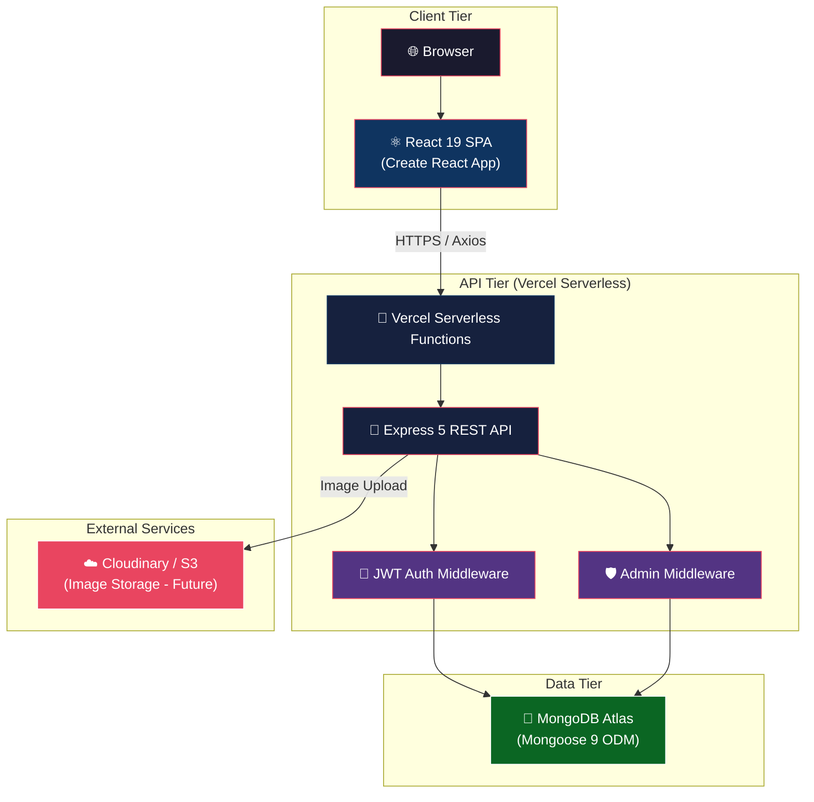
```mermaid
graph TB
    subgraph "Client Tier"
        Browser["🌐 Browser"]
        ReactApp["⚛️ React 19 SPA<br/>(Create React App)"]
    end

    subgraph "API Tier (Vercel Serverless)"
        APIGateway["🔗 Vercel Serverless Functions"]
        Express["🚂 Express 5 REST API"]
        AuthMW["🔐 JWT Auth Middleware"]
        AdminMW["🛡️ Admin Middleware"]
    end

    subgraph "Data Tier"
        MongoDB["🍃 MongoDB Atlas<br/>(Mongoose 9 ODM)"]
    end

    subgraph "External Services"
        Cloudinary["☁️ Cloudinary / S3<br/>(Image Storage - Future)"]
    end

    Browser --> ReactApp
    ReactApp -- "HTTPS / Axios" --> APIGateway
    APIGateway --> Express
    Express --> AuthMW
    Express --> AdminMW
    AuthMW --> MongoDB
    AdminMW --> MongoDB
    Express -- "Image Upload" --> Cloudinary

    style Browser fill:#1a1a2e,stroke:#e94560,color:#fff
    style ReactApp fill:#0f3460,stroke:#e94560,color:#fff
    style APIGateway fill:#16213e,stroke:#0f3460,color:#fff
    style Express fill:#16213e,stroke:#e94560,color:#fff
    style AuthMW fill:#533483,stroke:#e94560,color:#fff
    style AdminMW fill:#533483,stroke:#e94560,color:#fff
    style MongoDB fill:#0b6623,stroke:#fff,color:#fff
    style Cloudinary fill:#e94560,stroke:#fff,color:#fff
```

**Explanation:**
- The **React SPA** runs entirely in the browser and communicates with the backend via Axios HTTP client, sending a JWT `Bearer` token in the `Authorization` header for protected routes.
- The **Express API** is structured into routes → controllers → models. It uses [protect](file:///c:/Users/ANUJ/Desktop/clothly-main/clothly/backend/middleware/authMiddleware.js#4-21) middleware for authentication and [admin](file:///c:/Users/ANUJ/Desktop/clothly-main/clothly/backend/middleware/authMiddleware.js#22-28) middleware for admin-only endpoints.
- **MongoDB Atlas** serves as the cloud-hosted document database. Mongoose provides schema validation and model-layer abstraction.
- **Image uploads** currently use in-memory multer with base64 fallback; Cloudinary/S3 integration is planned for production.

---

## 2. Component Diagram

This diagram shows internal modules and how they interact within both the frontend and backend.

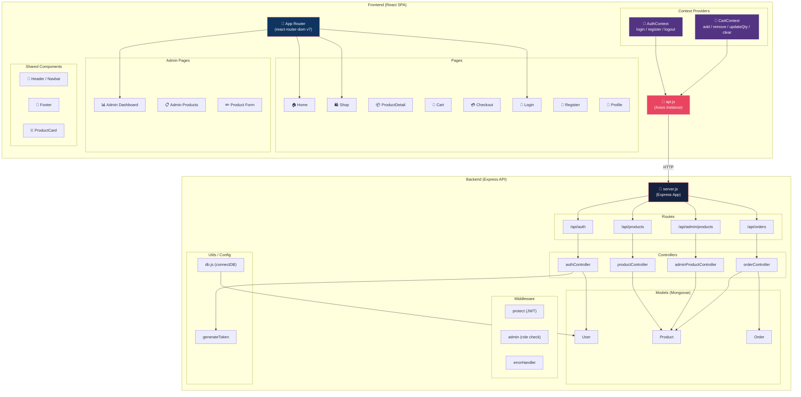
```mermaid
graph TB
    subgraph "Frontend (React SPA)"
        direction TB
        AppRouter["📱 App Router<br/>(react-router-dom v7)"]
        
        subgraph "Context Providers"
            AuthCtx["🔑 AuthContext<br/>login / register / logout"]
            CartCtx["🛒 CartContext<br/>add / remove / updateQty / clear"]
        end
        
        subgraph "Pages"
            Home["🏠 Home"]
            Shop["🛍️ Shop"]
            ProductDetail["📦 ProductDetail"]
            CartPage["🛒 Cart"]
            Checkout["💳 Checkout"]
            LoginPage["🔐 Login"]
            RegisterPage["📝 Register"]
            ProfilePage["👤 Profile"]
        end
        
        subgraph "Admin Pages"
            Dashboard["📊 Admin Dashboard"]
            AdminProducts["📋 Admin Products"]
            ProductForm["✏️ Product Form"]
        end
        
        subgraph "Shared Components"
            Header["📌 Header / Navbar"]
            Footer["📌 Footer"]
            ProductCard["🃏 ProductCard"]
        end
        
        APIClient["📡 api.js<br/>(Axios Instance)"]
    end
    
    subgraph "Backend (Express API)"
        direction TB
        Server["🚂 server.js<br/>(Express App)"]
        
        subgraph "Routes"
            AuthRoutes["/api/auth"]
            ProductRoutes["/api/products"]
            AdminRoutes["/api/admin/products"]
            OrderRoutes["/api/orders"]
        end
        
        subgraph "Controllers"
            AuthCtrl["authController"]
            ProductCtrl["productController"]
            AdminCtrl["adminProductController"]
            OrderCtrl["orderController"]
        end
        
        subgraph "Middleware"
            ProtectMW["protect (JWT)"]
            AdminMWComp["admin (role check)"]
            ErrorMW["errorHandler"]
        end
        
        subgraph "Models (Mongoose)"
            UserModel["User"]
            ProductModel["Product"]
            OrderModel["Order"]
        end
        
        subgraph "Utils / Config"
            GenToken["generateToken"]
            DBConfig["db.js (connectDB)"]
        end
    end

    AppRouter --> Home
    AppRouter --> Shop
    AppRouter --> LoginPage
    AppRouter --> Dashboard

    AuthCtx --> APIClient
    CartCtx --> APIClient
    APIClient -- "HTTP" --> Server

    Server --> AuthRoutes
    Server --> ProductRoutes
    Server --> AdminRoutes
    Server --> OrderRoutes

    AuthRoutes --> AuthCtrl
    ProductRoutes --> ProductCtrl
    AdminRoutes --> AdminCtrl
    OrderRoutes --> OrderCtrl

    AuthCtrl --> UserModel
    ProductCtrl --> ProductModel
    AdminCtrl --> ProductModel
    OrderCtrl --> OrderModel
    OrderCtrl --> ProductModel

    AuthCtrl --> GenToken
    DBConfig --> UserModel

    style AppRouter fill:#0f3460,stroke:#e94560,color:#fff
    style AuthCtx fill:#533483,stroke:#fff,color:#fff
    style CartCtx fill:#533483,stroke:#fff,color:#fff
    style Server fill:#16213e,stroke:#e94560,color:#fff
    style APIClient fill:#e94560,stroke:#fff,color:#fff
```

**Explanation:**
- **Frontend** is organized into **Pages** (route-level views), **Components** (reusable UI), **Context** (global state via React Context API), and an **API client** (centralized Axios instance with token interceptor).
- **Backend** follows the **MVC pattern**: `Routes` define endpoints and attach middleware, `Controllers` contain business logic, and `Models` define the MongoDB schemas.
- The [AdminRoute](file:///c:/Users/ANUJ/Desktop/clothly-main/clothly/frontend/src/App.js#18-23) wrapper on the frontend checks `user.isAdmin` before rendering admin pages.
- Shopping cart state is persisted in `localStorage` via `CartContext`, while authentication tokens are managed in `AuthContext`.

---

## 3. Deployment Diagram

Both frontend and backend are deployed on **Vercel** as separate projects.

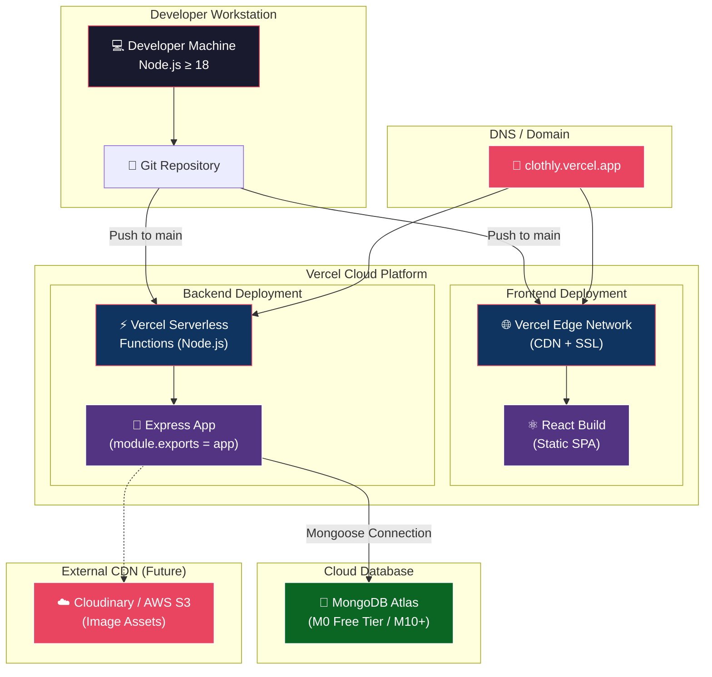
```mermaid
graph TB
    subgraph "Developer Workstation"
        DevMachine["💻 Developer Machine<br/>Node.js ≥ 18"]
        Git["📂 Git Repository"]
    end

    subgraph "Vercel Cloud Platform"
        subgraph "Frontend Deployment"
            VercelFE["🌐 Vercel Edge Network<br/>(CDN + SSL)"]
            ReactBuild["⚛️ React Build<br/>(Static SPA)"]
        end

        subgraph "Backend Deployment"
            VercelBE["⚡ Vercel Serverless<br/>Functions (Node.js)"]
            ExpressApp["🚂 Express App<br/>(module.exports = app)"]
        end
    end

    subgraph "Cloud Database"
        MongoAtlas["🍃 MongoDB Atlas<br/>(M0 Free Tier / M10+)"]
    end

    subgraph "DNS / Domain"
        CustomDomain["🔗 clothly.vercel.app"]
    end

    subgraph "External CDN (Future)"
        CloudinaryS3["☁️ Cloudinary / AWS S3<br/>(Image Assets)"]
    end

    DevMachine --> Git
    Git -- "Push to main" --> VercelFE
    Git -- "Push to main" --> VercelBE
    VercelFE --> ReactBuild
    VercelBE --> ExpressApp
    ExpressApp -- "Mongoose Connection" --> MongoAtlas
    CustomDomain --> VercelFE
    CustomDomain --> VercelBE
    ExpressApp -.-> CloudinaryS3

    style DevMachine fill:#1a1a2e,stroke:#e94560,color:#fff
    style VercelFE fill:#0f3460,stroke:#e94560,color:#fff
    style VercelBE fill:#0f3460,stroke:#e94560,color:#fff
    style ReactBuild fill:#533483,stroke:#fff,color:#fff
    style ExpressApp fill:#533483,stroke:#fff,color:#fff
    style MongoAtlas fill:#0b6623,stroke:#fff,color:#fff
    style CustomDomain fill:#e94560,stroke:#fff,color:#fff
    style CloudinaryS3 fill:#e94560,stroke:#fff,color:#fff
```

**Explanation:**
- **Frontend**: React app is built to static files (`react-scripts build`) and served via Vercel's global Edge Network (CDN) with automatic SSL. The [vercel.json](file:///c:/Users/ANUJ/Desktop/clothly-main/clothly/backend/vercel.json) handles SPA rewrites.
- **Backend**: The Express app is exported as a module (`module.exports = app`) and wrapped by Vercel's serverless handler. On Vercel, `app.listen()` is NOT called — Vercel invokes the handler per request.
- **MongoDB Atlas**: Hosted MongoDB cluster. Connection string is stored in environment variables (`MONGO_URI`).
- **CORS**: The backend whitelists the frontend's deployed URL (`CLIENT_URL` env var) and `localhost:3000` for development.

---

## 4. ER Diagram (Database Schema)

The database has three main collections: **Users**, **Products**, and **Orders**, with Orders embedding order items.

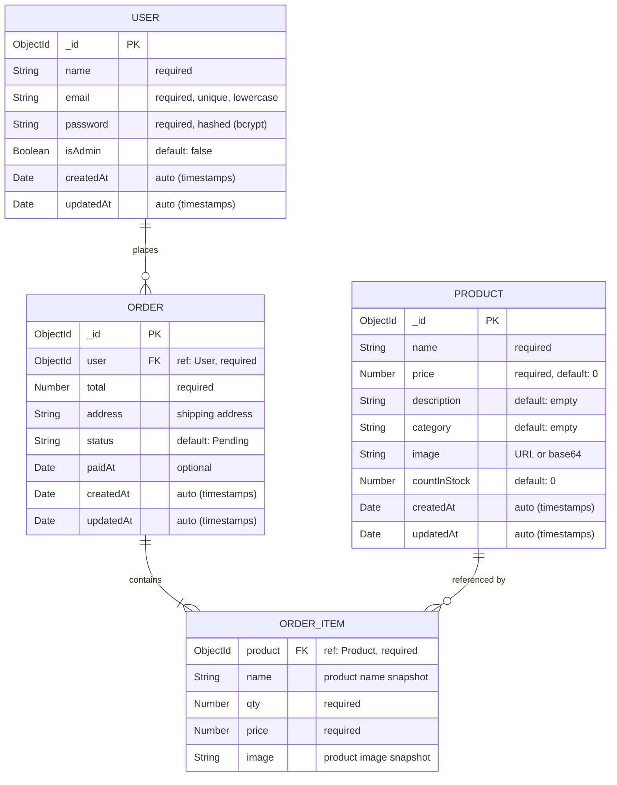
```mermaid
erDiagram
    USER {
        ObjectId _id PK
        String name "required"
        String email "required, unique, lowercase"
        String password "required, hashed (bcrypt)"
        Boolean isAdmin "default: false"
        Date createdAt "auto (timestamps)"
        Date updatedAt "auto (timestamps)"
    }

    PRODUCT {
        ObjectId _id PK
        String name "required"
        Number price "required, default: 0"
        String description "default: empty"
        String category "default: empty"
        String image "URL or base64"
        Number countInStock "default: 0"
        Date createdAt "auto (timestamps)"
        Date updatedAt "auto (timestamps)"
    }

    ORDER {
        ObjectId _id PK
        ObjectId user FK "ref: User, required"
        Number total "required"
        String address "shipping address"
        String status "default: Pending"
        Date paidAt "optional"
        Date createdAt "auto (timestamps)"
        Date updatedAt "auto (timestamps)"
    }

    ORDER_ITEM {
        ObjectId product FK "ref: Product, required"
        String name "product name snapshot"
        Number qty "required"
        Number price "required"
        String image "product image snapshot"
    }

    USER ||--o{ ORDER : "places"
    ORDER ||--|{ ORDER_ITEM : "contains"
    PRODUCT ||--o{ ORDER_ITEM : "referenced by"
```

**Explanation:**
- **User → Order**: One-to-Many. Each user can place multiple orders. The `user` field on Order references `User._id`.
- **Order → OrderItem**: One-to-Many (embedded). Order items are stored as a **sub-document array** within each Order document. This denormalizes product data (name, price, image) at the time of purchase to preserve historical accuracy.
- **Product → OrderItem**: Each order item references a product by `ObjectId`, but also stores a snapshot of the product name, price, and image at order time.
- The `password` field is excluded from JSON serialization by the [toJSON()](file:///c:/Users/ANUJ/Desktop/clothly-main/clothly/backend/models/User.js#13-19) method override on the User model.

---

## 5. Use Case Diagram

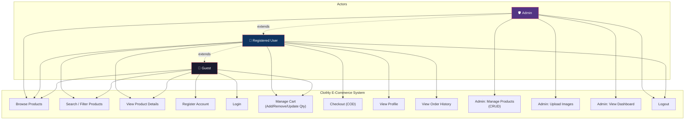
```mermaid
graph TB
    subgraph "Actors"
        Guest["👤 Guest"]
        User["👤 Registered User"]
        Admin["🛡️ Admin"]
    end

    subgraph "Clothly E-Commerce System"
        UC1["Browse Products"]
        UC2["Search / Filter Products"]
        UC3["View Product Details"]
        UC4["Register Account"]
        UC5["Login"]
        UC6["Manage Cart<br/>(Add/Remove/Update Qty)"]
        UC7["Checkout (COD)"]
        UC8["View Profile"]
        UC9["View Order History"]
        UC10["Admin: Manage Products<br/>(CRUD)"]
        UC11["Admin: Upload Images"]
        UC12["Admin: View Dashboard"]
        UC13["Logout"]
    end

    Guest --> UC1
    Guest --> UC2
    Guest --> UC3
    Guest --> UC4
    Guest --> UC5
    Guest --> UC6

    User --> UC1
    User --> UC2
    User --> UC3
    User --> UC6
    User --> UC7
    User --> UC8
    User --> UC9
    User --> UC13

    Admin --> UC10
    Admin --> UC11
    Admin --> UC12
    Admin --> UC1
    Admin --> UC13

    User -.->|"extends"| Guest
    Admin -.->|"extends"| User

    style Guest fill:#1a1a2e,stroke:#e94560,color:#fff
    style User fill:#0f3460,stroke:#e94560,color:#fff
    style Admin fill:#533483,stroke:#e94560,color:#fff
```

**Explanation:**
- **Guest**: Can browse, search, filter products, view details, register, login, and manage a local cart (persisted in `localStorage`).
- **Registered User**: Inherits all Guest capabilities plus checkout (COD), profile viewing, and order history.
- **Admin**: Inherits all User capabilities plus full CRUD on products, image upload, and access to the admin dashboard.
- Cart management works for Guests too because cart state is stored client-side in `localStorage` via `CartContext`.

---

## 6. Class Diagram

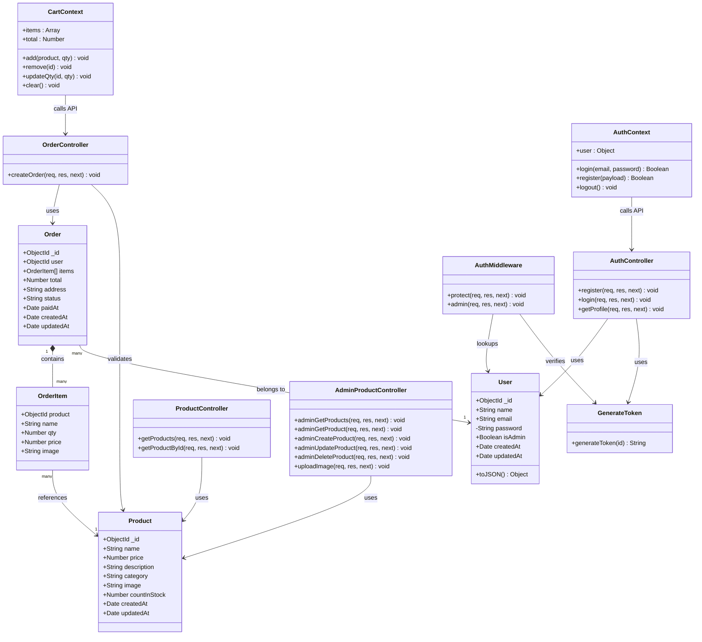
```mermaid
classDiagram
    class User {
        +ObjectId _id
        +String name
        +String email
        -String password
        +Boolean isAdmin
        +Date createdAt
        +Date updatedAt
        +toJSON() Object
    }

    class Product {
        +ObjectId _id
        +String name
        +Number price
        +String description
        +String category
        +String image
        +Number countInStock
        +Date createdAt
        +Date updatedAt
    }

    class OrderItem {
        +ObjectId product
        +String name
        +Number qty
        +Number price
        +String image
    }

    class Order {
        +ObjectId _id
        +ObjectId user
        +OrderItem[] items
        +Number total
        +String address
        +String status
        +Date paidAt
        +Date createdAt
        +Date updatedAt
    }

    class AuthController {
        +register(req, res, next) void
        +login(req, res, next) void
        +getProfile(req, res, next) void
    }

    class ProductController {
        +getProducts(req, res, next) void
        +getProductById(req, res, next) void
    }

    class AdminProductController {
        +adminGetProducts(req, res, next) void
        +adminGetProduct(req, res, next) void
        +adminCreateProduct(req, res, next) void
        +adminUpdateProduct(req, res, next) void
        +adminDeleteProduct(req, res, next) void
        +uploadImage(req, res, next) void
    }

    class OrderController {
        +createOrder(req, res, next) void
    }

    class AuthMiddleware {
        +protect(req, res, next) void
        +admin(req, res, next) void
    }

    class GenerateToken {
        +generateToken(id) String
    }

    class AuthContext {
        +user : Object
        +login(email, password) Boolean
        +register(payload) Boolean
        +logout() void
    }

    class CartContext {
        +items : Array
        +total : Number
        +add(product, qty) void
        +remove(id) void
        +updateQty(id, qty) void
        +clear() void
    }

    Order "1" *-- "many" OrderItem : contains
    Order "many" --> "1" User : belongs to
    OrderItem "many" --> "1" Product : references

    AuthController --> User : uses
    AuthController --> GenerateToken : uses
    ProductController --> Product : uses
    AdminProductController --> Product : uses
    OrderController --> Order : uses
    OrderController --> Product : validates

    AuthMiddleware --> User : lookups
    AuthMiddleware --> GenerateToken : verifies

    AuthContext --> AuthController : calls API
    CartContext --> OrderController : calls API
```

**Explanation:**
- **Models**: `User`, [Product](file:///c:/Users/ANUJ/Desktop/clothly-main/clothly/backend/controllers/productController.js#3-13), [Order](file:///c:/Users/ANUJ/Desktop/clothly-main/clothly/backend/controllers/orderController.js#4-35), and `OrderItem` (embedded sub-document) represent the data layer.
- **Controllers**: Each controller maps 1-to-1 with a route module and encapsulates business logic. The `AdminProductController` has the full CRUD suite plus image upload.
- **Middleware**: [protect](file:///c:/Users/ANUJ/Desktop/clothly-main/clothly/backend/middleware/authMiddleware.js#4-21) verifies JWT tokens and attaches `req.user`; [admin](file:///c:/Users/ANUJ/Desktop/clothly-main/clothly/backend/middleware/authMiddleware.js#22-28) checks the `isAdmin` flag.
- **Frontend Contexts**: `AuthContext` wraps login/register/logout logic; `CartContext` handles client-side shopping cart state.
- Relationships: Orders aggregate OrderItems (composition). Orders reference Users and OrderItems reference Products (association).

---

## 7. Sequence Diagrams

### 7.1 User Registration

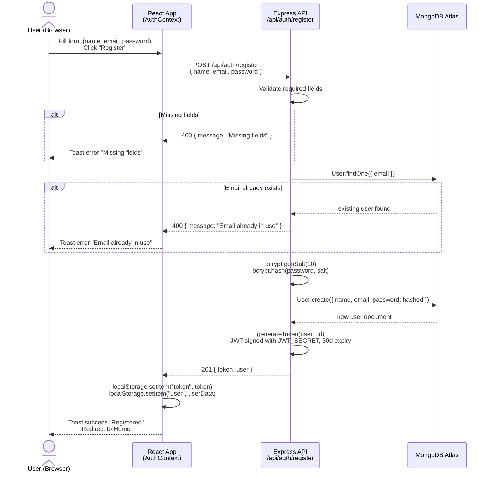
```mermaid
sequenceDiagram
    actor U as User (Browser)
    participant RC as React App<br/>(AuthContext)
    participant API as Express API<br/>/api/auth/register
    participant DB as MongoDB Atlas

    U->>RC: Fill form (name, email, password)<br/>Click "Register"
    RC->>API: POST /api/auth/register<br/>{ name, email, password }
    
    API->>API: Validate required fields
    alt Missing fields
        API-->>RC: 400 { message: "Missing fields" }
        RC-->>U: Toast error "Missing fields"
    end

    API->>DB: User.findOne({ email })
    alt Email already exists
        DB-->>API: existing user found
        API-->>RC: 400 { message: "Email already in use" }
        RC-->>U: Toast error "Email already in use"
    end

    API->>API: bcrypt.genSalt(10)<br/>bcrypt.hash(password, salt)
    API->>DB: User.create({ name, email, password: hashed })
    DB-->>API: new user document

    API->>API: generateToken(user._id)<br/>JWT signed with JWT_SECRET, 30d expiry

    API-->>RC: 201 { token, user }
    RC->>RC: localStorage.setItem("token", token)<br/>localStorage.setItem("user", userData)
    RC-->>U: Toast success "Registered"<br/>Redirect to Home
```

### 7.2 User Login

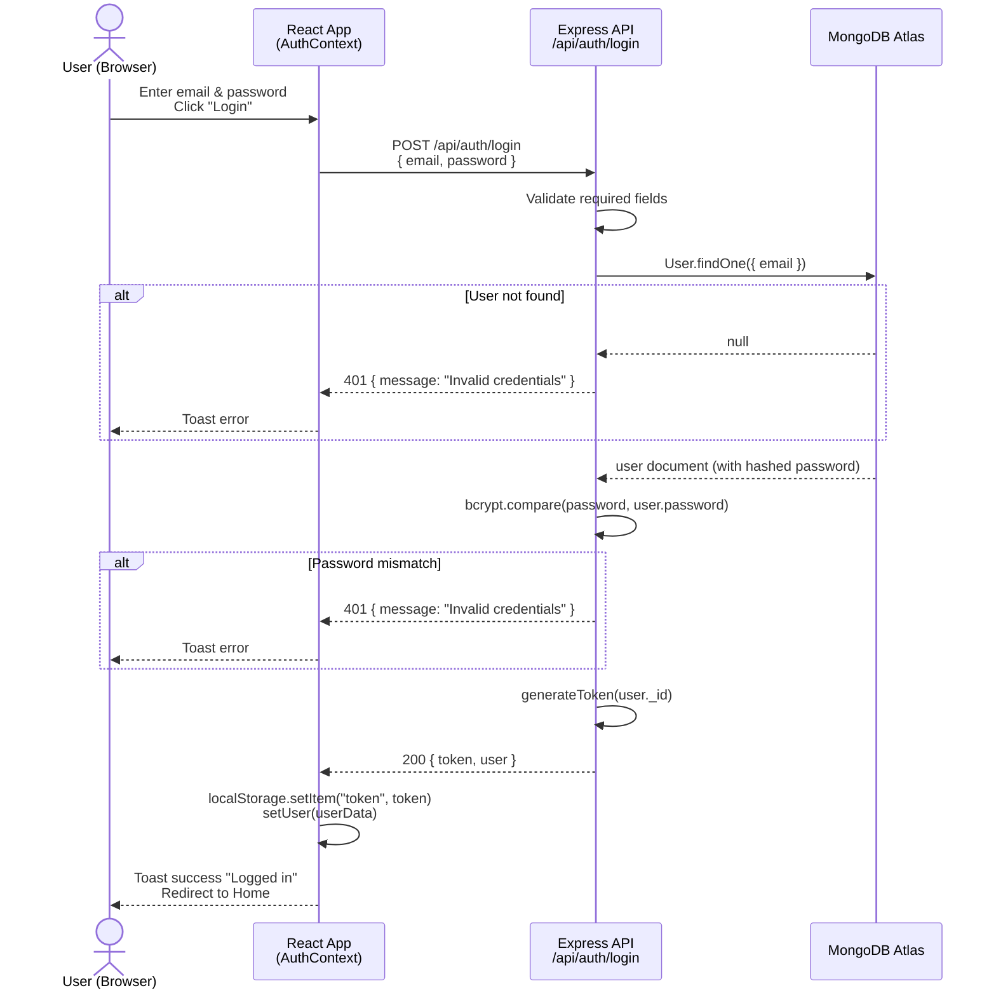
```mermaid
sequenceDiagram
    actor U as User (Browser)
    participant RC as React App<br/>(AuthContext)
    participant API as Express API<br/>/api/auth/login
    participant DB as MongoDB Atlas

    U->>RC: Enter email & password<br/>Click "Login"
    RC->>API: POST /api/auth/login<br/>{ email, password }

    API->>API: Validate required fields
    API->>DB: User.findOne({ email })
    
    alt User not found
        DB-->>API: null
        API-->>RC: 401 { message: "Invalid credentials" }
        RC-->>U: Toast error
    end

    DB-->>API: user document (with hashed password)
    API->>API: bcrypt.compare(password, user.password)

    alt Password mismatch
        API-->>RC: 401 { message: "Invalid credentials" }
        RC-->>U: Toast error
    end

    API->>API: generateToken(user._id)
    API-->>RC: 200 { token, user }

    RC->>RC: localStorage.setItem("token", token)<br/>setUser(userData)
    RC-->>U: Toast success "Logged in"<br/>Redirect to Home
```

### 7.3 Main Business Flow — Place an Order (Checkout COD)

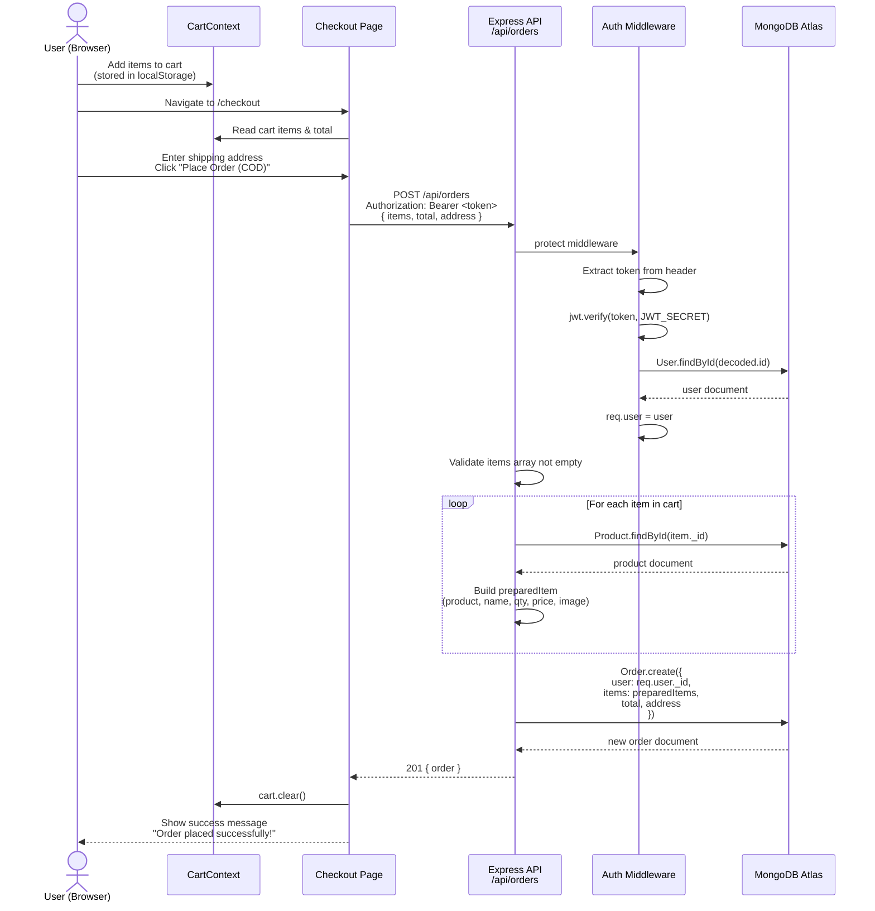
```mermaid
sequenceDiagram
    actor U as User (Browser)
    participant Cart as CartContext
    participant CKPage as Checkout Page
    participant API as Express API<br/>/api/orders
    participant MW as Auth Middleware
    participant DB as MongoDB Atlas

    U->>Cart: Add items to cart<br/>(stored in localStorage)
    U->>CKPage: Navigate to /checkout
    CKPage->>Cart: Read cart items & total

    U->>CKPage: Enter shipping address<br/>Click "Place Order (COD)"

    CKPage->>API: POST /api/orders<br/>Authorization: Bearer <token><br/>{ items, total, address }

    API->>MW: protect middleware
    MW->>MW: Extract token from header
    MW->>MW: jwt.verify(token, JWT_SECRET)
    MW->>DB: User.findById(decoded.id)
    DB-->>MW: user document
    MW->>MW: req.user = user

    API->>API: Validate items array not empty

    loop For each item in cart
        API->>DB: Product.findById(item._id)
        DB-->>API: product document
        API->>API: Build preparedItem<br/>(product, name, qty, price, image)
    end

    API->>DB: Order.create({<br/>  user: req.user._id,<br/>  items: preparedItems,<br/>  total, address<br/>})
    DB-->>API: new order document

    API-->>CKPage: 201 { order }
    CKPage->>Cart: cart.clear()
    CKPage-->>U: Show success message<br/>"Order placed successfully!"
```

**Explanation:**
- **Registration**: Server-side validation → duplicate email check → bcrypt hashing → user creation → JWT generation → return token + user.
- **Login**: Credential validation → password comparison → JWT generation → return token + user.
- **Checkout**: Cart items from `localStorage` are sent to the server. The [protect](file:///c:/Users/ANUJ/Desktop/clothly-main/clothly/backend/middleware/authMiddleware.js#4-21) middleware verifies the JWT. Each cart item is validated against the Products collection. An Order document is created with snapshotted product data.

---

## 8. Activity Diagrams

### 8.1 Complete Shopping Flow — From Browse to Order

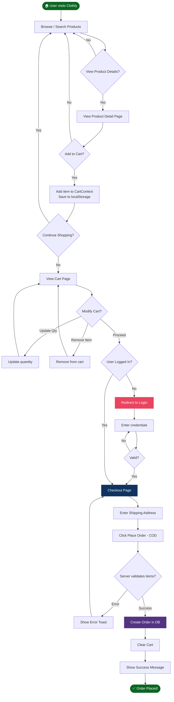
```mermaid
flowchart TD
    Start([🏠 User visits Clothly]) --> Browse[Browse / Search Products]
    Browse --> ViewProduct{View Product Details?}
    ViewProduct -->|Yes| ProductPage[View Product Detail Page]
    ViewProduct -->|No| Browse
    
    ProductPage --> AddCart{Add to Cart?}
    AddCart -->|No| Browse
    AddCart -->|Yes| UpdateCart[Add item to CartContext<br/>Save to localStorage]
    
    UpdateCart --> ContinueShopping{Continue Shopping?}
    ContinueShopping -->|Yes| Browse
    ContinueShopping -->|No| ViewCart[View Cart Page]
    
    ViewCart --> ModifyCart{Modify Cart?}
    ModifyCart -->|Update Qty| UpdateQty[Update quantity]
    UpdateQty --> ViewCart
    ModifyCart -->|Remove Item| RemoveItem[Remove from cart]
    RemoveItem --> ViewCart
    ModifyCart -->|Proceed| CheckAuth{User Logged In?}
    
    CheckAuth -->|No| LoginPage[Redirect to Login]
    LoginPage --> LoginAction[Enter credentials]
    LoginAction --> ValidateLogin{Valid?}
    ValidateLogin -->|No| LoginAction
    ValidateLogin -->|Yes| CheckoutPage
    
    CheckAuth -->|Yes| CheckoutPage[Checkout Page]
    CheckoutPage --> EnterAddress[Enter Shipping Address]
    EnterAddress --> PlaceOrder[Click Place Order - COD]
    PlaceOrder --> ValidateOrder{Server validates items?}
    
    ValidateOrder -->|Error| ShowError[Show Error Toast]
    ShowError --> CheckoutPage
    ValidateOrder -->|Success| CreateOrder[Create Order in DB]
    CreateOrder --> ClearCart[Clear Cart]
    ClearCart --> ShowSuccess[Show Success Message]
    ShowSuccess --> Finish([✅ Order Placed!])

    style Start fill:#0b6623,stroke:#fff,color:#fff
    style Finish fill:#0b6623,stroke:#fff,color:#fff
    style LoginPage fill:#e94560,stroke:#fff,color:#fff
    style CheckoutPage fill:#0f3460,stroke:#fff,color:#fff
    style CreateOrder fill:#533483,stroke:#fff,color:#fff
```

### 8.2 Admin Product Management Flow

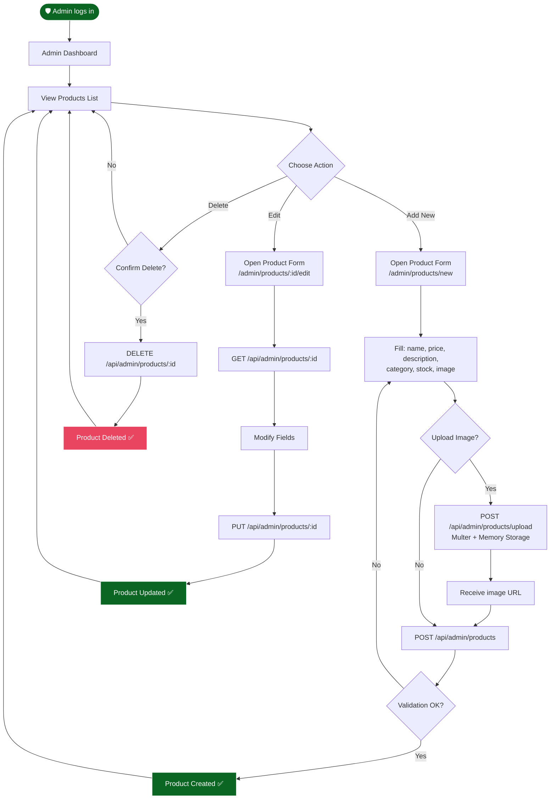
```mermaid
flowchart TD
    Start([🛡️ Admin logs in]) --> Dashboard[Admin Dashboard]
    Dashboard --> Products[View Products List]
    
    Products --> Action{Choose Action}
    
    Action -->|Add New| CreateForm[Open Product Form<br/>/admin/products/new]
    CreateForm --> FillForm[Fill: name, price, description,<br/>category, stock, image]
    FillForm --> UploadImg{Upload Image?}
    UploadImg -->|Yes| Upload[POST /api/admin/products/upload<br/>Multer + Memory Storage]
    Upload --> GetURL[Receive image URL]
    GetURL --> Submit
    UploadImg -->|No| Submit[POST /api/admin/products]
    Submit --> Validate{Validation OK?}
    Validate -->|No| FillForm
    Validate -->|Yes| Created[Product Created ✅]
    Created --> Products
    
    Action -->|Edit| EditForm[Open Product Form<br/>/admin/products/:id/edit]
    EditForm --> LoadData[GET /api/admin/products/:id]
    LoadData --> ModifyFields[Modify Fields]
    ModifyFields --> SaveUpdate[PUT /api/admin/products/:id]
    SaveUpdate --> Updated[Product Updated ✅]
    Updated --> Products
    
    Action -->|Delete| ConfirmDelete{Confirm Delete?}
    ConfirmDelete -->|No| Products
    ConfirmDelete -->|Yes| DeleteProd[DELETE /api/admin/products/:id]
    DeleteProd --> Deleted[Product Deleted ✅]
    Deleted --> Products

    style Start fill:#0b6623,stroke:#fff,color:#fff
    style Created fill:#0b6623,stroke:#fff,color:#fff
    style Updated fill:#0b6623,stroke:#fff,color:#fff
    style Deleted fill:#e94560,stroke:#fff,color:#fff
```

**Explanation:**
- **Shopping Flow**: Depicts the complete user journey from browsing → cart management → authentication check → checkout → order creation.
- **Admin Flow**: Shows the three main operations (Create, Edit, Delete) for products, including the image upload sub-flow via Multer.

---

## 9. State Machine Diagram

### 9.1 Order Lifecycle

The `Order.status` field tracks the lifecycle of an order from placement to completion.

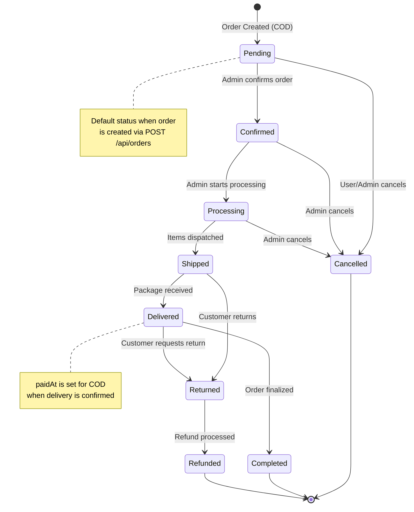
```mermaid
stateDiagram-v2
    [*] --> Pending : Order Created (COD)
    
    Pending --> Confirmed : Admin confirms order
    Pending --> Cancelled : User/Admin cancels
    
    Confirmed --> Processing : Admin starts processing
    Confirmed --> Cancelled : Admin cancels
    
    Processing --> Shipped : Items dispatched
    Processing --> Cancelled : Admin cancels
    
    Shipped --> Delivered : Package received
    Shipped --> Returned : Customer returns

    Delivered --> Completed : Order finalized
    Delivered --> Returned : Customer requests return
    
    Returned --> Refunded : Refund processed
    
    Cancelled --> [*]
    Completed --> [*]
    Refunded --> [*]

    note right of Pending
        Default status when order
        is created via POST /api/orders
    end note

    note right of Delivered
        paidAt is set for COD
        when delivery is confirmed
    end note
```

### 9.2 User Authentication State

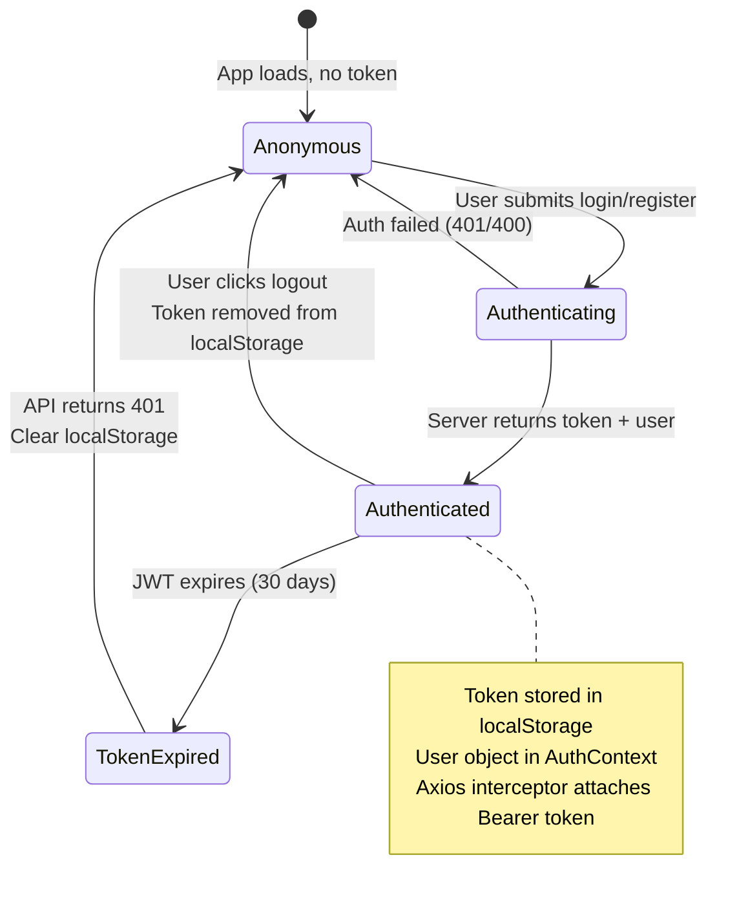
```mermaid
stateDiagram-v2
    [*] --> Anonymous : App loads, no token
    
    Anonymous --> Authenticating : User submits login/register
    
    Authenticating --> Authenticated : Server returns token + user
    Authenticating --> Anonymous : Auth failed (401/400)
    
    Authenticated --> Anonymous : User clicks logout<br/>Token removed from localStorage
    
    Authenticated --> TokenExpired : JWT expires (30 days)
    TokenExpired --> Anonymous : API returns 401<br/>Clear localStorage

    note right of Authenticated
        Token stored in localStorage
        User object in AuthContext
        Axios interceptor attaches Bearer token
    end note
```

**Explanation:**
- **Order Lifecycle**: Currently the system creates orders in `Pending` status. The future states (Confirmed, Processing, Shipped, Delivered, etc.) represent the planned order management workflow. The `paidAt` field is set when COD payment is collected on delivery.
- **Auth State**: The user starts `Anonymous`, transitions to `Authenticated` on successful login/register, and returns to `Anonymous` on logout or token expiry.

---

## 10. Data Flow Diagram (DFD)

### 10.1 Level 0 (Context Diagram)

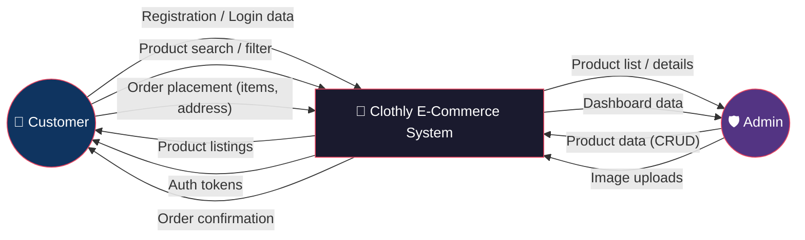
```mermaid
graph LR
    Customer(("👤 Customer"))
    Admin(("🛡️ Admin"))
    System["🏪 Clothly E-Commerce System"]
    
    Customer -- "Registration / Login data" --> System
    Customer -- "Product search / filter" --> System
    Customer -- "Order placement (items, address)" --> System
    System -- "Product listings" --> Customer
    System -- "Auth tokens" --> Customer
    System -- "Order confirmation" --> Customer
    
    Admin -- "Product data (CRUD)" --> System
    Admin -- "Image uploads" --> System
    System -- "Product list / details" --> Admin
    System -- "Dashboard data" --> Admin

    style Customer fill:#0f3460,stroke:#e94560,color:#fff
    style Admin fill:#533483,stroke:#e94560,color:#fff
    style System fill:#1a1a2e,stroke:#e94560,color:#fff
```

### 10.2 Level 1 (Detailed DFD)

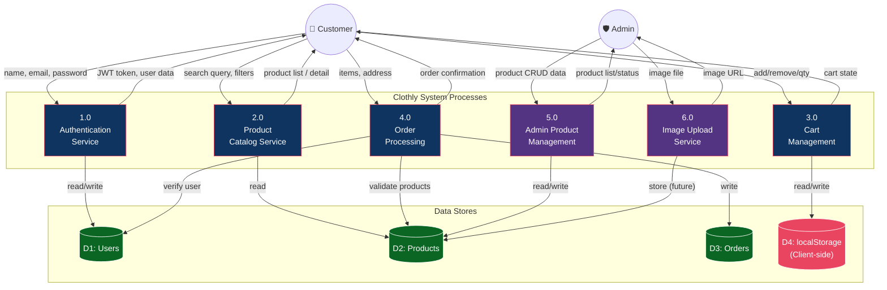
```mermaid
graph TB
    Customer(("👤 Customer"))
    Admin(("🛡️ Admin"))
    
    subgraph "Clothly System Processes"
        P1["1.0<br/>Authentication<br/>Service"]
        P2["2.0<br/>Product<br/>Catalog Service"]
        P3["3.0<br/>Cart<br/>Management"]
        P4["4.0<br/>Order<br/>Processing"]
        P5["5.0<br/>Admin Product<br/>Management"]
        P6["6.0<br/>Image Upload<br/>Service"]
    end
    
    subgraph "Data Stores"
        DS1[("D1: Users")]
        DS2[("D2: Products")]
        DS3[("D3: Orders")]
        DS4[("D4: localStorage<br/>(Client-side)")]
    end

    Customer -- "name, email, password" --> P1
    P1 -- "JWT token, user data" --> Customer
    P1 -- "read/write" --> DS1
    
    Customer -- "search query, filters" --> P2
    P2 -- "product list / detail" --> Customer
    P2 -- "read" --> DS2
    
    Customer -- "add/remove/qty" --> P3
    P3 -- "cart state" --> Customer
    P3 -- "read/write" --> DS4
    
    Customer -- "items, address" --> P4
    P4 -- "order confirmation" --> Customer
    P4 -- "validate products" --> DS2
    P4 -- "write" --> DS3
    P4 -- "verify user" --> DS1
    
    Admin -- "product CRUD data" --> P5
    P5 -- "product list/status" --> Admin
    P5 -- "read/write" --> DS2
    
    Admin -- "image file" --> P6
    P6 -- "image URL" --> Admin
    P6 -- "store (future)" --> DS2

    style P1 fill:#0f3460,stroke:#e94560,color:#fff
    style P2 fill:#0f3460,stroke:#e94560,color:#fff
    style P3 fill:#0f3460,stroke:#e94560,color:#fff
    style P4 fill:#0f3460,stroke:#e94560,color:#fff
    style P5 fill:#533483,stroke:#e94560,color:#fff
    style P6 fill:#533483,stroke:#e94560,color:#fff
    style DS1 fill:#0b6623,stroke:#fff,color:#fff
    style DS2 fill:#0b6623,stroke:#fff,color:#fff
    style DS3 fill:#0b6623,stroke:#fff,color:#fff
    style DS4 fill:#e94560,stroke:#fff,color:#fff
```

**Explanation:**
- **Level 0**: Shows the system as a single black box interacting with two external actors (Customer and Admin).
- **Level 1**: Breaks the system into 6 processes: Authentication, Product Catalog, Cart Management (client-side), Order Processing, Admin Product Management, and Image Upload. Data stores include MongoDB collections (Users, Products, Orders) and browser `localStorage` for cart state.

---

## 11. Flowcharts

### 11.1 User Registration & Login Flow

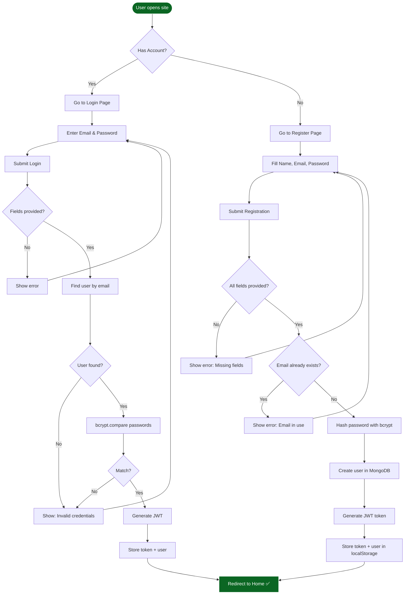
```mermaid
flowchart TD
    Start([User opens site]) --> HasAccount{Has Account?}
    
    HasAccount -->|Yes| LoginPage[Go to Login Page]
    HasAccount -->|No| RegisterPage[Go to Register Page]
    
    RegisterPage --> FillReg[Fill Name, Email, Password]
    FillReg --> SubmitReg[Submit Registration]
    SubmitReg --> CheckFields1{All fields provided?}
    CheckFields1 -->|No| ShowError1[Show error: Missing fields]
    ShowError1 --> FillReg
    CheckFields1 -->|Yes| CheckDup{Email already exists?}
    CheckDup -->|Yes| ShowError2[Show error: Email in use]
    ShowError2 --> FillReg
    CheckDup -->|No| HashPassword[Hash password with bcrypt]
    HashPassword --> CreateUser[Create user in MongoDB]
    CreateUser --> GenToken1[Generate JWT token]
    GenToken1 --> StoreToken1[Store token + user in localStorage]
    StoreToken1 --> RedirectHome[Redirect to Home ✅]
    
    LoginPage --> FillLogin[Enter Email & Password]
    FillLogin --> SubmitLogin[Submit Login]
    SubmitLogin --> CheckFields2{Fields provided?}
    CheckFields2 -->|No| ShowError3[Show error]
    ShowError3 --> FillLogin
    CheckFields2 -->|Yes| FindUser[Find user by email]
    FindUser --> UserExists{User found?}
    UserExists -->|No| ShowError4[Show: Invalid credentials]
    ShowError4 --> FillLogin
    UserExists -->|Yes| ComparePass[bcrypt.compare passwords]
    ComparePass --> PassMatch{Match?}
    PassMatch -->|No| ShowError4
    PassMatch -->|Yes| GenToken2[Generate JWT]
    GenToken2 --> StoreToken2[Store token + user]
    StoreToken2 --> RedirectHome

    style Start fill:#0b6623,stroke:#fff,color:#fff
    style RedirectHome fill:#0b6623,stroke:#fff,color:#fff
```

### 11.2 Product Purchase Flow

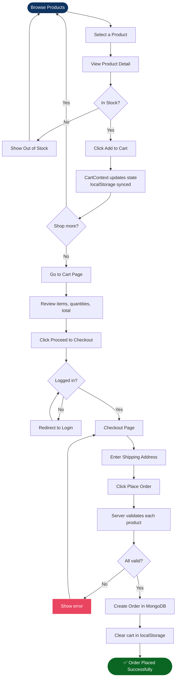
```mermaid
flowchart TD
    Start([Browse Products]) --> Select[Select a Product]
    Select --> Detail[View Product Detail]
    Detail --> InStock{In Stock?}
    InStock -->|No| OutMsg[Show Out of Stock]
    OutMsg --> Start
    InStock -->|Yes| AddToCart[Click Add to Cart]
    AddToCart --> CartUpdate[CartContext updates state<br/>localStorage synced]
    CartUpdate --> More{Shop more?}
    More -->|Yes| Start
    More -->|No| GoCart[Go to Cart Page]
    GoCart --> ReviewCart[Review items, quantities, total]
    ReviewCart --> Proceed[Click Proceed to Checkout]
    Proceed --> LoggedIn{Logged in?}
    LoggedIn -->|No| Login[Redirect to Login]
    Login --> LoggedIn
    LoggedIn -->|Yes| Checkout[Checkout Page]
    Checkout --> Address[Enter Shipping Address]
    Address --> PlaceOrder[Click Place Order]
    PlaceOrder --> Validate[Server validates each product]
    Validate --> Valid{All valid?}
    Valid -->|No| Error[Show error]
    Error --> Checkout
    Valid -->|Yes| SaveOrder[Create Order in MongoDB]
    SaveOrder --> ClearCart[Clear cart in localStorage]
    ClearCart --> Success([✅ Order Placed Successfully])

    style Start fill:#0f3460,stroke:#fff,color:#fff
    style Success fill:#0b6623,stroke:#fff,color:#fff
    style Error fill:#e94560,stroke:#fff,color:#fff
```

**Explanation:**
- **Auth Flow**: Covers both registration and login paths with all validation steps, error handling, and the final token storage.
- **Purchase Flow**: End-to-end from product browsing through cart management to successful checkout.

---

## 12. API Endpoint Map

### 12.1 Authentication APIs

| Endpoint | Method | Auth | Description | Request Body | Response |
|---|---|---|---|---|---|
| `/api/auth/register` | `POST` | ❌ Public | Register a new user | `{ name, email, password }` | `201 { token, user: { _id, name, email, isAdmin } }` |
| `/api/auth/login` | `POST` | ❌ Public | Login with credentials | `{ email, password }` | `200 { token, user: { _id, name, email, isAdmin } }` |
| `/api/auth/profile` | `GET` | 🔐 Bearer | Get current user profile | — | `200 { _id, name, email, isAdmin, createdAt, updatedAt }` |

### 12.2 Public Product APIs

| Endpoint | Method | Auth | Description | Query Params | Response |
|---|---|---|---|---|---|
| `/api/products` | `GET` | ❌ Public | Get all products | `?limit=N` (optional) | `200 [ { _id, name, price, description, category, image, countInStock, ... } ]` |
| `/api/products/:id` | `GET` | ❌ Public | Get single product by ID | — | `200 { _id, name, price, description, category, image, countInStock, ... }` |

### 12.3 Admin Product APIs

> [!IMPORTANT]
> All admin endpoints require **Bearer token** authentication AND **`isAdmin: true`** on the user.

| Endpoint | Method | Auth | Description | Request Body | Response |
|---|---|---|---|---|---|
| `/api/admin/products` | `GET` | 🛡️ Admin | List all products (admin view) | — | `200 [ { ...product } ]` |
| `/api/admin/products/:id` | `GET` | 🛡️ Admin | Get single product (admin) | — | `200 { ...product }` |
| `/api/admin/products` | `POST` | 🛡️ Admin | Create a new product | `{ name*, price*, description, category, image, countInStock }` | `201 { ...product }` |
| `/api/admin/products/:id` | `PUT` | 🛡️ Admin | Update existing product | `{ name, price, description, category, image, countInStock }` | `200 { ...product }` |
| `/api/admin/products/:id` | `DELETE` | 🛡️ Admin | Delete a product | — | `200 { message: "Deleted" }` |
| `/api/admin/products/upload` | `POST` | 🛡️ Admin | Upload product image | `FormData { image: File }` (max 5MB, image/* only) | `200 { url: "data:..." }` |

### 12.4 Order APIs

| Endpoint | Method | Auth | Description | Request Body | Response |
|---|---|---|---|---|---|
| `/api/orders` | `POST` | 🔐 Bearer | Create a new order (COD) | `{ items: [{ _id, qty }], total, address }` | `201 { _id, user, items: [...], total, address, status, createdAt }` |

### 12.5 System APIs

| Endpoint | Method | Auth | Description | Response |
|---|---|---|---|---|
| `/api/health` | `GET` | ❌ Public | Health check endpoint | `200 { ok: true, env: "development" }` |

### 12.6 Error Response Format

All error responses follow this consistent format:

```json
{
  "message": "Human-readable error description"
}
```

| Status Code | Meaning |
|---|---|
| `400` | Bad Request — Missing required fields or invalid data |
| `401` | Unauthorized — Token missing, invalid, or expired |
| `403` | Forbidden — Admin privileges required |
| `404` | Not Found — Resource does not exist |
| `500` | Internal Server Error — Unhandled exception (caught by errorHandler) |

---

## 📋 Summary

| Aspect | Technology / Pattern |
|---|---|
| **Frontend** | React 19, React Router v7, Axios, Bootstrap 5, React Toastify, Lucide Icons |
| **Backend** | Express 5, Node.js ≥ 18, Mongoose 9 ODM |
| **Database** | MongoDB Atlas (Document DB) |
| **Authentication** | JWT (Bearer Token), bcryptjs for password hashing |
| **Authorization** | Role-based (`isAdmin` flag) with [protect](file:///c:/Users/ANUJ/Desktop/clothly-main/clothly/backend/middleware/authMiddleware.js#4-21) + [admin](file:///c:/Users/ANUJ/Desktop/clothly-main/clothly/backend/middleware/authMiddleware.js#22-28) middleware |
| **File Upload** | Multer (memory storage), base64 fallback (Cloudinary/S3 planned) |
| **State Management** | React Context API (AuthContext, CartContext) + localStorage |
| **Deployment** | Vercel (Serverless for backend, CDN for frontend) |
| **API Pattern** | RESTful with consistent JSON responses |
| **Architecture** | 3-tier (Client → API → Database), MVC pattern on backend |

> [!TIP]
> **Scalability Recommendations:**
> - Add **Redis** for session caching and rate limiting
> - Integrate **Cloudinary** or **AWS S3** for production image storage
> - Add **Stripe/Razorpay** for online payment processing
> - Implement **pagination** and **text search indexes** on products
> - Add **order management** endpoints for admin (update status, view all orders)
> - Consider **Docker** containerization for consistent deployments
> - Add **API rate limiting** with `express-rate-limit`
> - Implement **email notifications** (order confirmation, password reset) with SendGrid/Nodemailer
